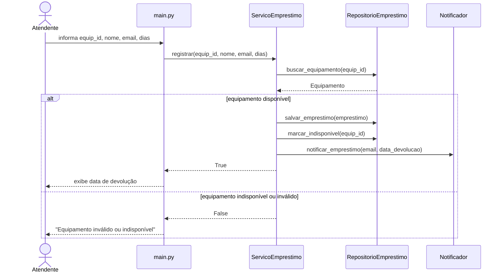
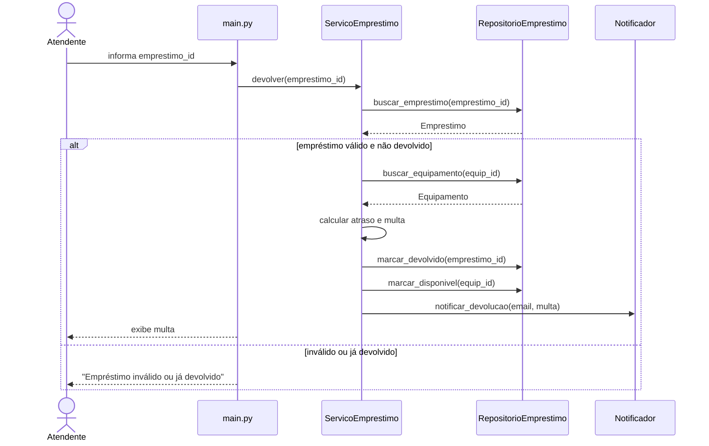
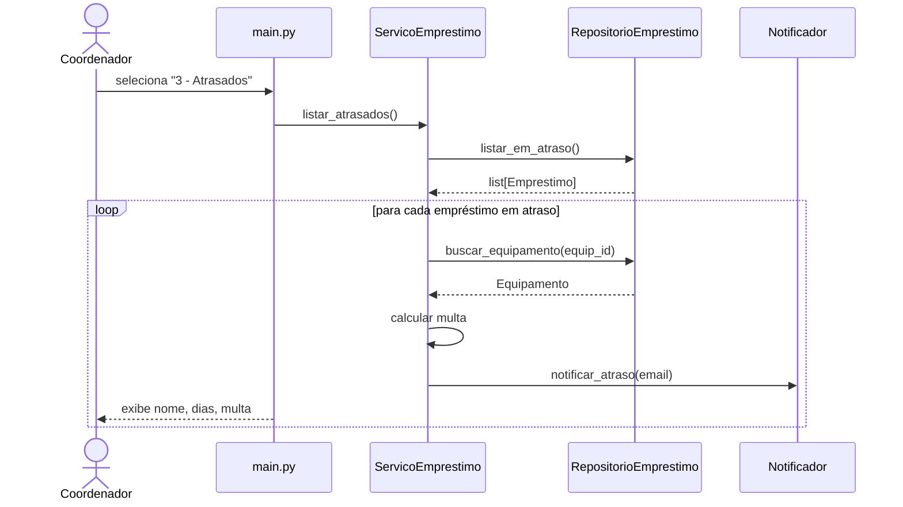

# Diagramas de Sequência — v2.0

> Este arquivo é a **solução-guia das Partes 2 e 3 da Atividade 4a**: traz os 3 diagramas
> de sequência prontos (UC01 já estava no `comando.md`; UC02 e UC03 aqui como referência
> opcional para você comparar depois) e as **assinaturas dos métodos** que viram os stubs.
>
> Para a **Parte 1 da Atividade 4a (decomposição em camadas com justificativa)**,
> consulte a Q2(c) da resenha modelo (`solucao/docs/resenha-aula03.md`).

## UC01 — Registrar Empréstimo

## UC02 — Registrar Devolução

## UC03 — Listar Empréstimos em Atraso

## Assinaturas extraídas dos diagramas

### ServicoEmprestimo
- `registrar(equipamento_id, usuario_nome, usuario_email, dias) -> bool`
- `devolver(emprestimo_id) -> None`
- `listar_atrasados() -> None`

### RepositorioEmprestimo
- `buscar_equipamento(id) -> Equipamento`
- `salvar_emprestimo(emprestimo) -> None`
- `buscar_emprestimo(id) -> Emprestimo`
- `marcar_indisponivel(equip_id) -> None`
- `marcar_disponivel(equip_id) -> None`
- `marcar_devolvido(emprestimo_id) -> None`
- `listar_em_atraso() -> list`
- `proximo_id_emprestimo() -> int`

### Notificador
- `notificar_emprestimo(email, data_devolucao) -> None`
- `notificar_devolucao(email, multa) -> None`
- `notificar_atraso(email) -> None`
